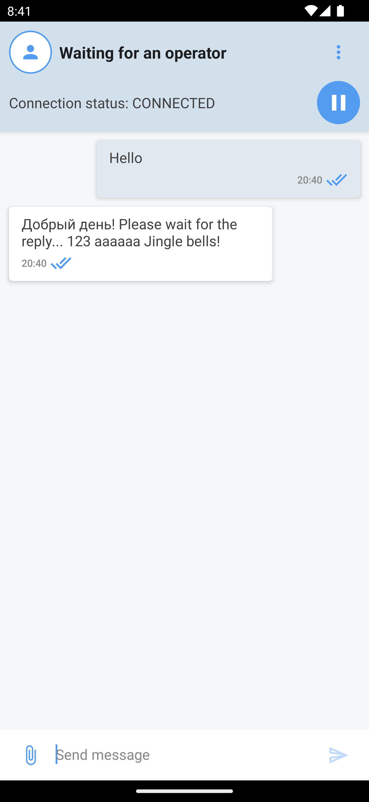
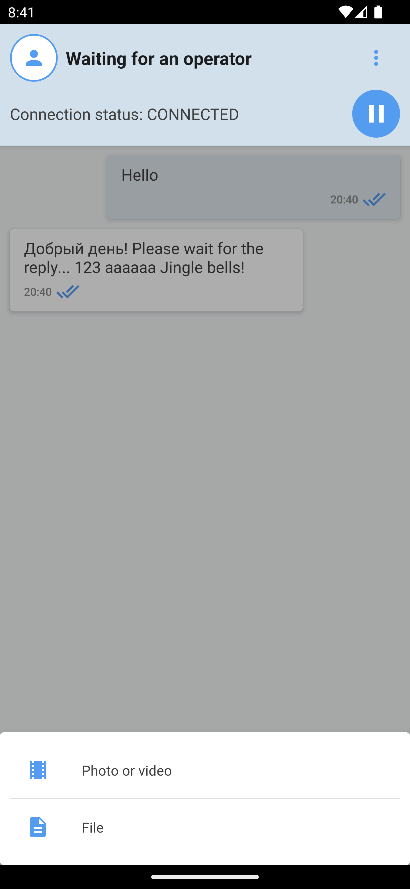
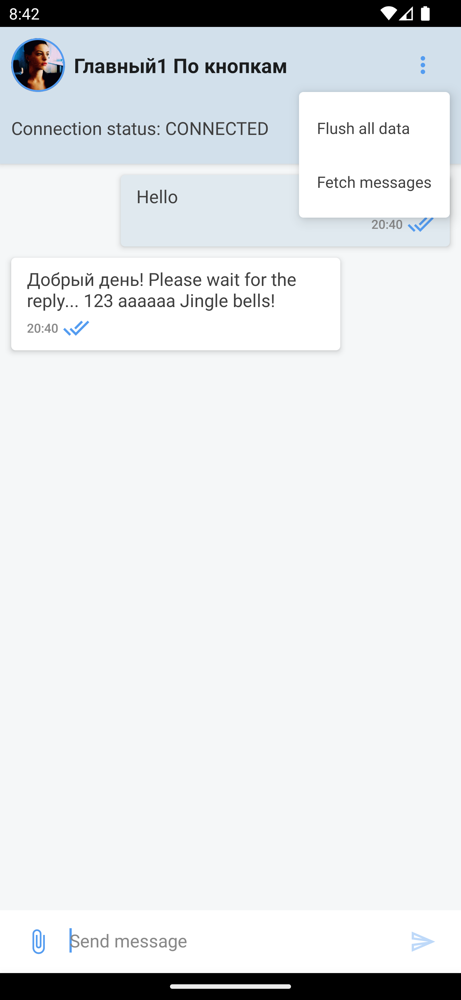

# Chat2Desk SDK Demo

This demo demonstrates chat integration using the Chat2Desk Android SDK. The application supports chat operations with Chat2Desk service.

## Features
The application is able to:
- send message
- send message with attachment
- receive an incoming message
- fetch message history from Chat2Desk
- send client data to the Chat2Desk
- receive an operator info
- save the message history and allows you to add messages when there is no connection, followed by sending

## Getting started

To get start you'll need the account on Chat2Desk and channel with Online Widget.

1. Get the parameters from widget settings:
- widget token
- server urls
2. Create the `apikey.properties` file on `app` folder with next content:
````
WIDGET_TOKEN="YOUR_WIDGET_TOKEN_HERE"  
BASE_HOST="YOUR_BASE_HOST_TOKEN_HERE"  
WS_HOST="YOUR_WS_HOST_TOKEN_HERE"  
STORAGE_HOST="YOUR_STORAGE_TOKEN_HERE"
````
3. Build and run app.

## Usage

###  Message list
<table>
<tr>
<td>Main</td>
<td>Select Attachment</td>
<td>Dropdown menu</td>
</tr>
<tr>
<td></td>
<td></td>
<td></td>
</tr>
</table>

## Useful links
1. [Using Chat2Desk SDK](https://chat2desk.atlassian.net/wiki/external/453247004/ZTdmYjQ3YzQ0MDFkNGU4MjhlOGIzZjlmYjQ1MmViYjE?atlOrigin=eyJpIjoiOTk2ZjdlOTdiNjg3NDY4YTk2YWU0NDg3MGVhNWI5MjIiLCJwIjoiYyJ9)
2. [SDK Reference](https://sdk.chat2desk.com)

##  Have a question

- contact us via `develop@chat2desk.com`
- create an issue
